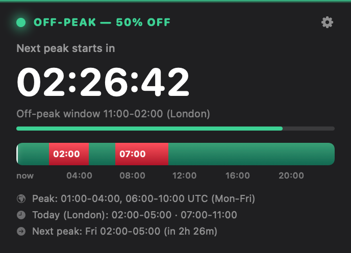
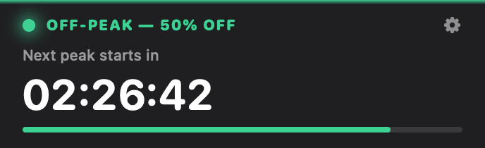

# DeepSeek Peak

**Know when DeepSeek API off-peak pricing starts — right from your Mac.**

A small, native desktop widget and menu bar countdown. Compact when you need
space, detailed when you want the next 24 hours at a glance.

[**Download for Mac**](https://github.com/MirekOlecko/deepseek-peak/releases/latest) ·
[Report an issue](https://github.com/MirekOlecko/deepseek-peak/issues) ·
[MIT license](LICENSE)

<p align="center">
  
  <br><br>
  
</p>

## Download and install

**macOS 13 Ventura or newer. One universal app for Apple Silicon and Intel.**

1. Open [Latest release](https://github.com/MirekOlecko/deepseek-peak/releases/latest)
   and download `DeepSeekPeak-1.0.0-macOS-universal.dmg` (or the ZIP).
2. Open the disk image and drag **DeepSeekPeak.app** to **Applications**.
3. Launch it from Applications. The widget and menu bar indicator appear;
   there is deliberately no Dock icon.

**First launch:** this initial community release is ad-hoc signed and **not
notarized by Apple**. If macOS blocks it, first verify the download came from
this repository, then use **System Settings → Privacy & Security → Open Anyway**
after attempting to open the app. See [Apple's instructions](https://support.apple.com/en-us/102445).
You do not need to disable Gatekeeper globally or run terminal commands.
Managed Macs may prevent this exception.

Release assets include SHA256 checksums. Building from source is also supported.
The release was checked on Apple Silicon; its Intel slice was also checked
under Rosetta. Intel hardware and every supported macOS version
have not been individually tested.

## Features

- Green off-peak and red peak status, with a live countdown.
- Full widget with a 24-hour timeline and local-time schedule.
- Compact mode with status, countdown and progress only.
- Menu bar countdown and controls, even when the widget is hidden.
- Drag to position; float above windows or sit behind them on the desktop.
- Optional rate-change notifications and launch at login.
- Editable local schedule, so schedule changes do not require recompilation.

Use the gear menu, right-click the widget, or click its menu bar indicator.
Choose **Quit DeepSeek Peak** there to close it. Notifications require macOS
permission. Enable **Launch at login** after moving the app to Applications.

## Schedule and accuracy

The bundled schedule follows [DeepSeek's official pricing documentation](https://api-docs.deepseek.com/quick_start/pricing/),
checked on **10 September 2026**:

| Peak window (UTC) | Days |
| --- | --- |
| 01:00–04:00 | Monday–Friday |
| 06:00–10:00 | Monday–Friday |

Outside those windows the documented off-peak rate is half the peak rate.
Calculations use UTC; local labels follow your Mac's time zone, including daylight
saving. Keep the Mac's clock accurate.

**This is a schedule indicator, not a live billing monitor.** It does not query
DeepSeek, inspect your API usage, or automatically download pricing changes.
Check official pricing for your model and update the schedule when necessary.
The 2× / 50% labels assume the published ratio; a future ratio change would require
an application update. Preview images are illustrative, not a current rate quote.

This is an independent community project, not affiliated with or endorsed by
DeepSeek. DeepSeek's name belongs to its respective owner.

## Privacy

No API key, account, telemetry or analytics. The application calculates the schedule
locally, stores preferences on your Mac, and optionally posts local notifications.
It opens DeepSeek's pricing website in your browser only when you choose that menu
item. Your personal schedule and preferences are not included in downloads.

## Schedule — editable without recompiling

DeepSeek may change its price list. The app then reads the schedule from:

```
~/Library/Application Support/DeepSeekPeak/schedule.json
```

The file is created automatically on first launch (menu → **Edit schedule**). Format:

```json
{
  "note": "Peak: 01:00-04:00 and 06:00-10:00 UTC, Mon-Fri.",
  "rules": [
    { "weekdays": [2, 3, 4, 5, 6], "startMinuteUTC": 60,  "endMinuteUTC": 240 },
    { "weekdays": [2, 3, 4, 5, 6], "startMinuteUTC": 360, "endMinuteUTC": 600 }
  ]
}
```

- `weekdays`: 1 = Sunday, 2 = Monday, ... 7 = Saturday,
- `startMinuteUTC` / `endMinuteUTC`: minutes from UTC midnight (60 = 01:00, 240 = 04:00),
- an `endMinuteUTC` less than or equal to `startMinuteUTC` means the window crosses midnight.

After saving the file: menu → **Reload schedule**.

## Build from source

Requires macOS 13+ and Xcode with Swift 5.9 or later. No third-party dependencies.

```sh
git clone https://github.com/MirekOlecko/deepseek-peak.git
cd deepseek-peak
swift test
./scripts/build-app.sh release
open build/DeepSeekPeak.app
```

The build script creates both `arm64` and `x86_64` slices, increments the bundle
build number before each build, and verifies an ad-hoc signature. It does not
install or replace your existing application. To build and install explicitly:

```sh
./scripts/install-app.sh release
```

To package the existing build without recompiling:

```sh
./scripts/package-release.sh
```

See [the release checklist](docs/RELEASING.md) for verification and distribution.

## Tests and previews

`swift test` covers UTC window boundaries, weekday/weekend transitions, timeline
continuity, custom schedules and London/Warsaw time conversion.

```sh
build/DeepSeekPeak.app/Contents/MacOS/DeepSeekPeak --render /tmp/widget.png
build/DeepSeekPeak.app/Contents/MacOS/DeepSeekPeak --render /tmp/widget-compact.png --compact
build/DeepSeekPeak.app/Contents/MacOS/DeepSeekPeak --self-test-levels
```

The last command reports the window levels and sizes while toggling display modes.

## Project layout

```text
Package.swift                  SwiftPM package
Sources/DeepSeekPeakCore/       Schedule engine and time formatting
Sources/DeepSeekPeak/           AppKit + SwiftUI application
Tests/DeepSeekPeakCoreTests/    Schedule tests
Resources/Info.plist            Application metadata
scripts/                       Build, local install and release packaging
```

## License

[MIT](LICENSE) — copyright © 2026 MirekOlecko.
